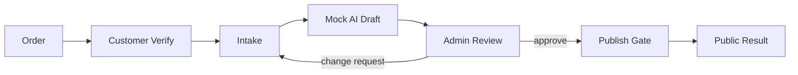

# AI Workflow Assurance Demo

> **Clean-room portfolio demo for accounting / assurance recruiting**  
> A small end-to-end workflow showing how customer input, automated content generation, human review, publication controls, and auditability can be designed together.

This repository is **not a copy of a production service**. It was rebuilt from scratch for portfolio use with synthetic orders, a deterministic local mock generator, generic UI, and no production credentials or commercial assets.

## Why I built this

The project started from a practical question: **how can a repetitive, personalized service workflow be turned into a structured and controllable process?**

The demo focuses less on flashy AI output and more on the parts that matter in a real process:

- validating that a request belongs to a known order;
- normalizing customer input before processing;
- separating generation from human approval;
- preventing publication before review;
- preserving an audit trail of important state changes;
- keeping secrets and production intellectual property out of the repository.

## Demo flow



### Workflow states

`ORDER_VERIFIED → INTAKE_SUBMITTED → DRAFT_GENERATED → APPROVED → PUBLISHED`

A draft cannot be published directly from the generated state.

## Run locally

Requirements: **Node.js 20+**. No npm dependencies are required.

```bash
npm start
```

Open:

- Customer demo: `http://localhost:3000/customer.html`
- Admin demo: `http://localhost:3000/admin.html`

### Demo credentials

Customer sample:

```text
Order number: DEMO-2026-0001
Customer name: 김민준
```

Admin password:

```text
portfolio-demo
```

You can override the admin password with `DEMO_ADMIN_PASSWORD`.

## What to try

1. Verify the sample customer order.
2. Submit a story and generate a mock draft.
3. Open the Admin page and log in.
4. Observe `DRAFT_GENERATED` and the audit events.
5. Approve the draft.
6. Publish it only after approval.
7. Open the generated public result URL.
8. Try manually creating the same order number twice and observe duplicate prevention.

## Control-oriented design

| Risk | Demo response |
|---|---|
| duplicate/fabricated order | unique order validation |
| cross-customer access | order-scoped customer session |
| incomplete input | required/minimum input validation |
| AI output released automatically | explicit human review |
| approval bypass | publish status gate |
| weak traceability | actor/time/event audit trail |
| leaked secrets | environment-based configuration |
| portfolio IP leakage | clean-room code + synthetic data |

See [`docs/CONTROLS_AND_RISKS.md`](docs/CONTROLS_AND_RISKS.md) for the full assurance-style mapping.

## Repository structure

```text
ai-workflow-assurance-demo/
├─ README.md
├─ NOTICE.md
├─ SECURITY.md
├─ data/
│  └─ synthetic-orders.json
├─ docs/
│  ├─ ARCHITECTURE.md
│  ├─ CONTROLS_AND_RISKS.md
│  ├─ DATA_FLOW.md
│  ├─ INTERVIEW_NOTES.md
│  └─ PORTFOLIO_BOUNDARY.md
├─ public/
│  ├─ index.html
│  ├─ customer.html
│  ├─ admin.html
│  ├─ result.html
│  ├─ css/app.css
│  └─ js/
└─ src/
   ├─ ai/mock-generator.js
   ├─ data/demo-store.js
   ├─ domain/
   ├─ http/
   └─ server.js
```

## Deliberately excluded

This demo does **not** include real e-commerce connectors, cloud database credentials, production schemas, customer photos/audio, production prompts, production business rules, or live external AI calls. See [`NOTICE.md`](NOTICE.md).

## Production extension

If this were hardened for a real service, the next priorities would be persistent database constraints and RLS, managed secrets, idempotent external connector jobs, queue/retry handling, immutable audit logs, monitoring/alerting, and stronger role-based approval controls.

## Interview framing

The main point of this repository is not “I built an AI website.” It is:

> **I translated an ambiguous manual workflow into explicit data states, identified operational risks, designed preventive/detective controls around those risks, and implemented a small system that preserves human accountability and traceability.**

See [`docs/INTERVIEW_NOTES.md`](docs/INTERVIEW_NOTES.md) for a concise interview explanation.
