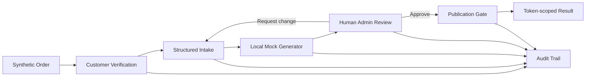

# Architecture

## Purpose

This repository demonstrates how a small real-world workflow can be decomposed into explicit responsibilities and control points without exposing production intellectual property.

## Components

- `src/data/demo-store.js`: in-memory synthetic store.
- `src/domain/control-rules.js`: workflow status and validation rules.
- `src/domain/order-service.js`: business-flow orchestration and audit events.
- `src/ai/mock-generator.js`: deterministic local generator; no external AI call.
- `src/server.js`: HTTP routes and role/session boundaries.
- `public/`: customer, admin and result interfaces.

## Deliberate simplifications

The production-equivalent concerns below are documented rather than implemented: persistent DB, row-level security, API queues, real order connectors, cloud file storage, production secrets, third-party AI, payment data and monitoring.
